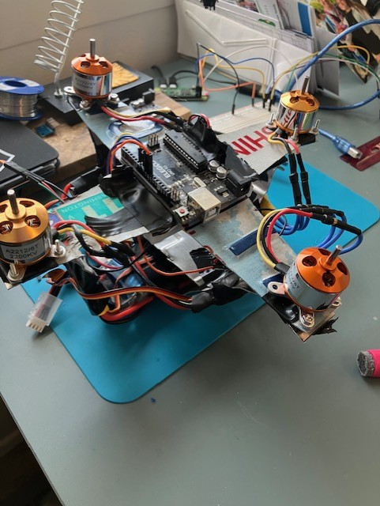

## Welcome! 

My name is Lucas Rassbach and I am a software engineer, and part time masters student at the Georgia Institute of Technology, with a focus on Machine Learning, Robotics, and Statistics.

## This site is to document BrickForceOne, and may be upgraded in the future to showcase other projects.

# Brick Force One :construction:

## Overview

Brick Force One (BF1) is a quadcopter built with RaspberryPi Zero W and Arduino Uno. RaspberryPi manages the flight contoller, and is expandable to in the future receive commands from a seperate control module. Arduino manages the motor speeds and controls.

The goal of this project is to:

1. Create a robot that can fly being controlled by a remote control. The first iteration will be controlled via the command line & SSH. The next iteration will be controlled using a remote control, likely using RaspberryPi Zero W.
2. Use GPS, Reinforcement Learning and mission planning to create autonomous point to point flight.
3. Implement a computer vision model to perform counting operations while airborne (number of cars, trees, etc.).

## Phase One: Remote Flight

### Early Challenges Influencing Design

BF1 started out originally as a dual copter. When this design was proven to be inherently more difficult from a flight control perspective, the design was shifted to a quadcopter. Originally designed to run on a single Arduino uno, the decision was made to upgrade to the RaspberryPi Zero W to enable faster and easier software development. 

During initial flight software development, the final quad copter frame was not assembled as it was not required.

### Hardware

#### Frame
The frame is built from aluminum cut from an old Washington state license plate. This was cheap, easy, and worked. The designs were sketched by hand. With limited aerospace experience, the design choices were made based on the following factors: 1. No contact between rotors 2. Compact design preferred.

#### Motors 
There are 4 2200 KV Brushless Motors with ESC modules that provide all thrust for BF1. These motors were chosen after early testing with the dual copter demonstrated sufficient thrust produced. The built in ESC modules allow for easy integration with Arduino's Servo.h library.

#### Gyroscope/Accelerometer
The MPU6050 module is the gyroscope chosen due to its cheap price point and wide support. Two MPU6050s were procured for this project, one presoldered and wired and one unsoldered. This was a fun way to start soldering, which is important because several unintroduced components will require soldering.

#### Breadboard
I am using the breadboard for now until I get better at soldering. Faster time to market!

#### Battery
TODO